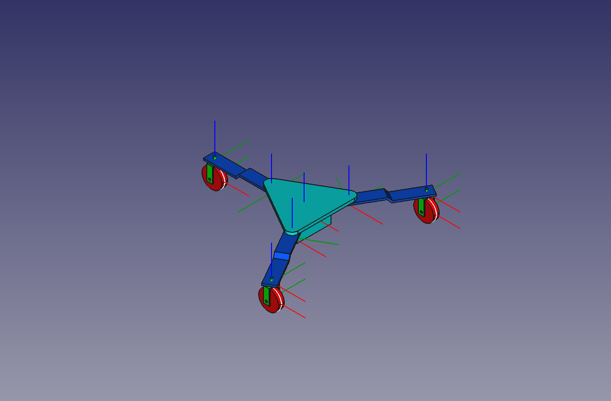
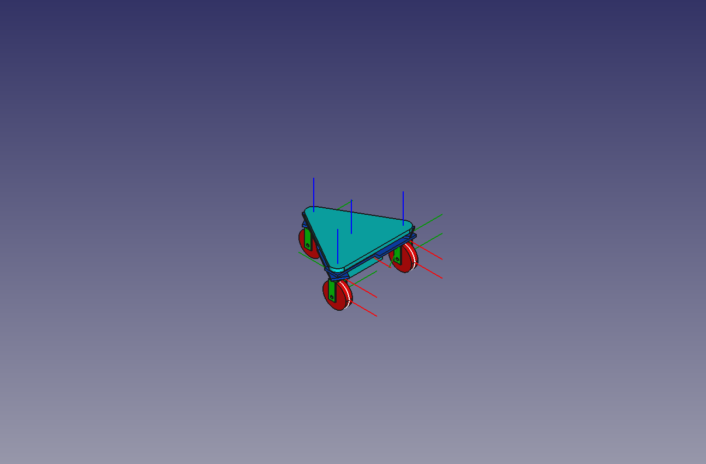

# FreeCAD Model of ROAMR

## Installation and Dependencies

### FreeCAD Installation

For this project, we're using AppImage released on GitHub with the version controlled by
[install_freecad.sh](scripts/install_freecad.sh). To install FreeCAD from AppImage, run the
following command with `sudo`. This will download the AppImage to a new direcory and create
a symlink `freecad` in `/usr/local/bin/` so that you can launch the app by typing `freecad`.

```bash
cd /path/to/roamr/freecad_roamr/scripts
sudo ./install_freecad.sh install # remove to uninstall
# => Installing FreeCAD AppImage...
# => ...
# => FreeCAD AppImage installed successfully.
```

You can also install the app using other means. Suitable app version is at least 1.x. Other scripts
just depend on running the GUI using `freecad` in the terminal.

### Python Packages

The following packages may need to be installed manually:

- PySide
- PyYAML

TODO(#15)

## Configurations in `roamr_robot_asm`

### Extended



### Collapsed



### Long


### Wide


